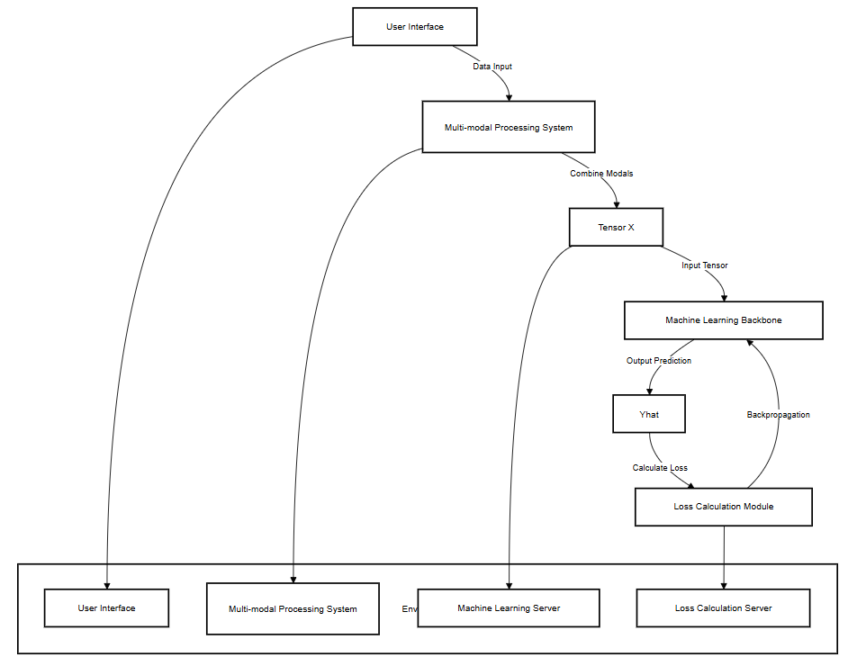
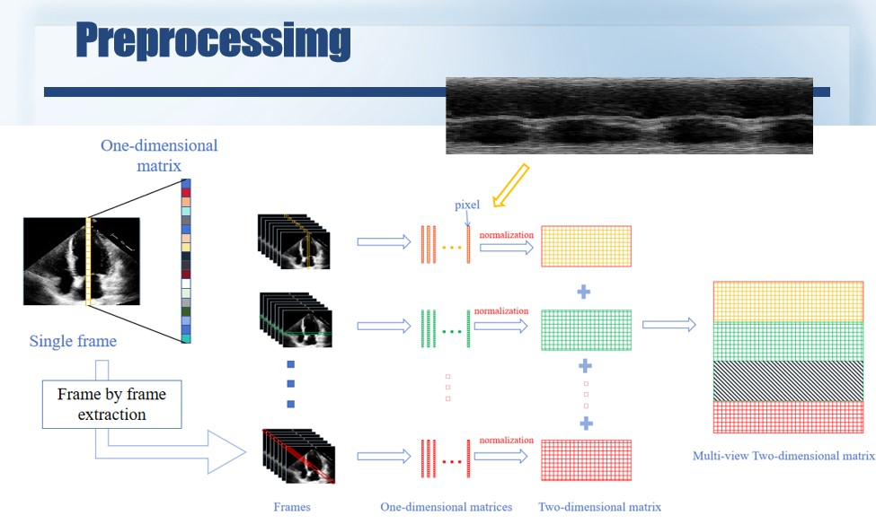
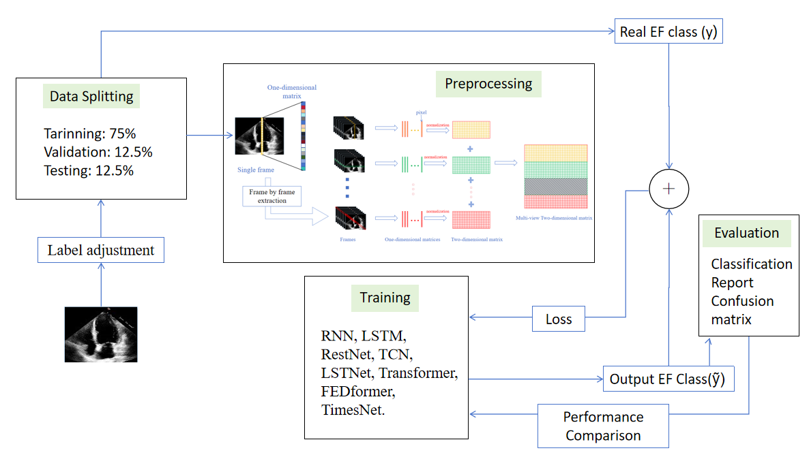

# Capstone Project
Optimizing Multi-Modal Echocardiographic Video Classification for Ejection Fraction Prediction

## Dataset
The EchoNet-Dynamic dataset is a publicly available dataset provided by Stanford University School of Medicine. It contains echocardiography videos of heart function and is primarily intended for research purposes in developing AI-based methods for cardiac function analysis, specifically focusing on ejection fraction estimation.

Video Format: The dataset consists of apical 4-chamber echocardiogram videos.
Labels: Includes ejection fraction (EF) values, manually labeled by clinical experts.
Size: Thousands of videos, with EF labels, provided for training, validation, and testing purposes.
Use Case: Useful for developing and evaluating deep learning models for video-based cardiac analysis.

To obtain the EchoNet-Dynamic dataset:

Register: Visit the Stanford University EchoNet-Dynamic webpage and complete the registration process.
Agree to Terms: You must agree to the Research Use Agreement and Stanford's Terms of Use.
Download: Once registered and approved, you will receive a download link for the dataset, which is for individual, non-commercial research use only.

# System Design

# Preprocessing

# Framework

